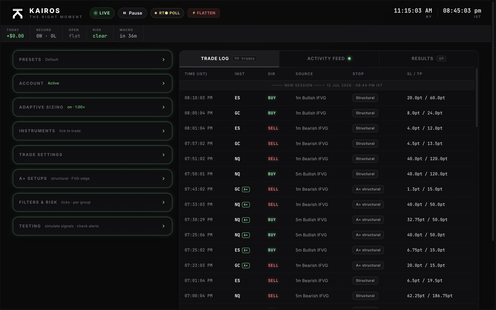
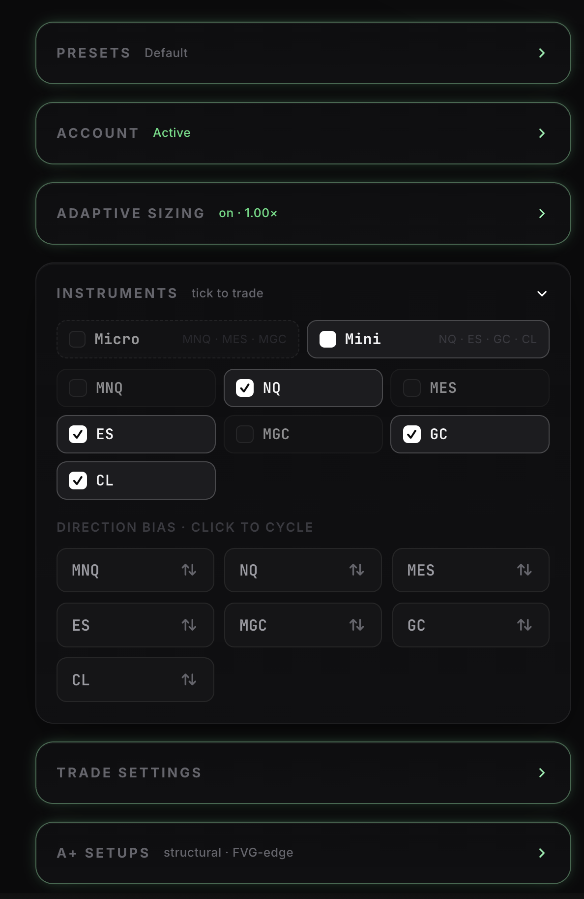
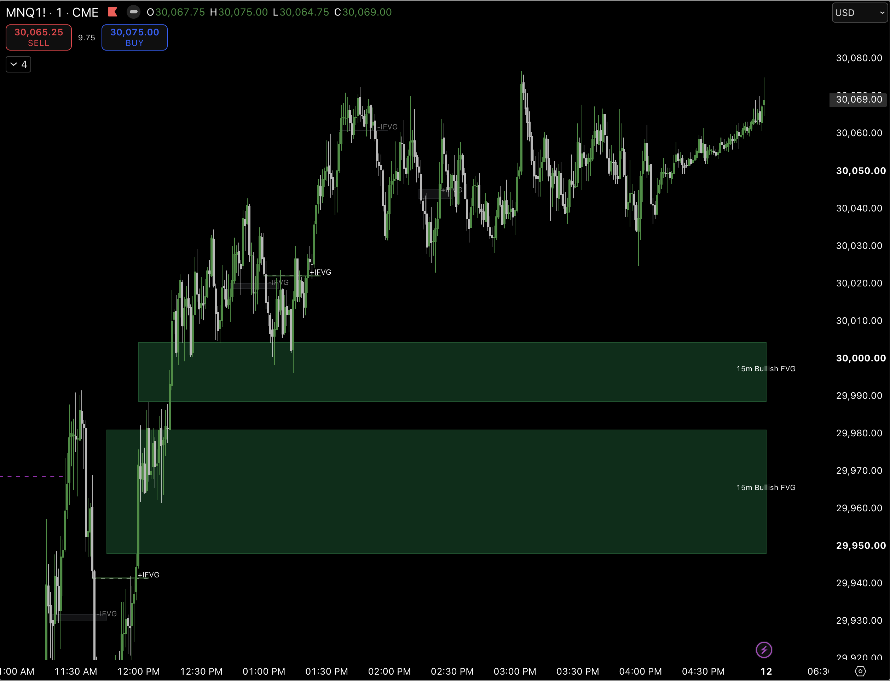
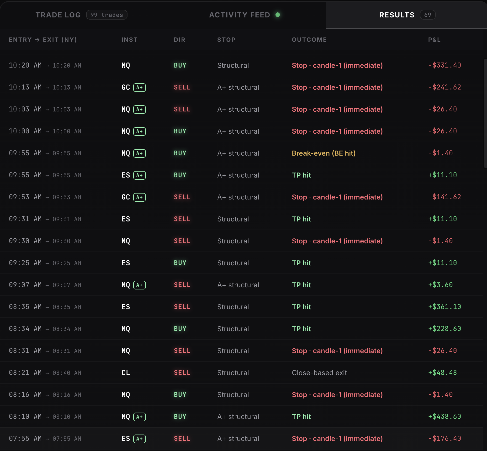

# KAIROS

> **IMPORTANT SIGNAL CHANGE: KAIROS no longer alerts on candle 2. Every entry alert now fires only after candle 3 has closed and the complete IFVG, overlap, and liquidity-sweep conditions are confirmed. Recreate any older TradingView alerts after adding this version.**

**KAIROS** is an automated futures-trading system built around Inverted Fair Value Gaps (IFVG). It has two halves that talk to each other over a webhook:

1. **A TradingView Pine Script indicator** (`alertbot.pine`) that detects strict IFVG setups on intraday charts and fires only when candle 3 closes. It also draws **higher-timeframe (15m / 1h / 4h) FVGs** right on your chart as visual context, with per-timeframe toggles, colors, and filled/unfilled tracking.
2. **A Python (FastAPI) execution bot** (`main.py`) that receives those alerts, validates and filters them, and places bracket orders on futures through the **ProjectX / TopstepX API** — with live fill tracking over SignalR websockets, structural (close-based) invalidation exits, per-instrument risk filters, opt-in **adaptive position sizing** (a win-scaled risk ladder on the micros), Discord/Telegram trade notifications, persistent state, and a token-protected web dashboard for live control (pause, position sizing, instrument toggles, presets, account switching, flatten-all).

Supported instruments: **MNQ / NQ, MES / ES, MGC / GC, CL** (micro and full-size Nasdaq, S&P, Gold, and Crude futures).



This repository contains the **complete sanitized product**: the full v7 Pine indicator, execution bot, risk controls, adaptive sizing, dashboard, analytics, deployment helpers, and documentation. It deliberately excludes credentials, live account state, logs, results, and private business material.

---

## Complete feature guide

### Signal engine and chart visuals

- **Strict candle-3 confirmation** — a signal requires a new opposite FVG on candle 3, overlap with the earlier FVG, and a qualifying liquidity sweep. The whole gate runs on `barstate.isconfirmed`, so no entry alert is emitted from candle 2 or during an unfinished candle 3.
- **Configurable setup search** — adjust the prior-setup lookback, liquidity scan range, box projection length, and source-side minimum imbalance. The minimum-imbalance input suppresses alerts without hiding otherwise valid chart drawings.
- **IFVG lifecycle drawings** — bullish/bearish boxes, labels, optional Consequent Encroachment midpoint, projection, custom colors, label sizes, dark/light themes, and delete-or-dim invalidation behavior are built in.
- **Pivot liquidity sweeps** — optional legacy pivot-sweep markers support four sensitivity levels for traders who want extra chart context alongside the strict setup engine.
- **Editable market sessions** — Asia, London, and New York windows, colors, visibility, timezone, daylight-saving-aware market zones, high/low liquidity lines, and a compact session table are configurable from indicator settings.
- **A+ chart classification** — A+ means a sweep of an enabled Asia/London/New York session high or low followed by a matching strict IFVG within the setup lookback. A+ labels and initial/swing stop guides are displayed on the chart.
- **Higher-timeframe FVG overlay** — show 15-minute, 1-hour, and 4-hour FVGs with independent timeframe toggles. Filled and unfilled bullish/bearish gaps have separate visibility and last-1/3/5 limits, with filled gaps ranked by fill time.
- **Multi-timeframe bias table** — 5m, 15m, 1h, 4h, and 12h bias is derived from the last respected, still-valid FVG on each timeframe and presented as bullish, bearish, or neutral.
- **Flexible alert output** — choose Text, Webhook JSON, or Both; supply custom bullish/bearish text and a secret through indicator settings. JSON includes the execution levels and A+ metadata the bot needs.
- **Structural exit alerts** — after a normal structural entry is armed, a confirmed close beyond its candle-1 invalidation level can emit a direction- and timeframe-matched exit message.

### A+ execution model

- **Definition** — the setup must sweep an enabled Asia, London, or New York session H/L, then complete the strict candle-3 IFVG confirmation. A higher-timeframe target is useful but is not required for A+ classification.
- **Initial protection** — long A+ orders use candle 1's low and short A+ orders use candle 1's high as the first attached protective stop while the market order and broker bracket are created.
- **Runner transition** — because the alert itself is intentionally delayed until candle 3 has closed, the bot pins the filled bracket to candle 1 and then immediately moves every live A+ stop to the Pine-provided swing low/high. If the broker does not confirm every stop modification, candle-1 protection remains and the bot retries rather than declaring the transition complete.
- **A+ target** — the preferred take-profit is the near edge of the closest fresh 15m/1h FVG in the trade direction. If none is usable, the dashboard's per-market fallback distance is used.
- **A+ risk isolation** — a master enable switch and per-New-York-session entry cap apply only to A+ signals. A+ may bypass soft time-window gates, but it still obeys authentication, instrument enablement, direction, minimum-FVG, maximum swing-stop, pause, exposure, and anti-hedging controls.

### Instruments, sizing, and exposure

- **Seven supported contracts** — MNQ, NQ, MES, ES, MGC, GC, and CL are resolved to the active futures contract without confusing micro and full-size symbols.
- **Per-symbol controls** — enable/disable every instrument and set long-only, short-only, or both. Direction choice is synchronized across instruments that share a no-hedge group.
- **Account-size sizing** — Custom, 50K, 100K, and 150K profiles drive contract quantities, with separate micro/full-size behavior and a one-contract cap on full-size products.
- **No accidental stacking or reversal** — same-direction alerts do not stack beyond the configured cap, and opposite alerts do not auto-reverse an open position. Order handling is serialized to prevent simultaneous webhook races.
- **Account-wide anti-hedging** — MNQ/NQ/MES/ES form one equity-index group and MGC/GC form one gold group; opposing positions inside a group are blocked or resolved. CL remains independent.
- **Adaptive exposure lock** — adaptive mode permits one open position account-wide and micros only, preventing another instrument from opening until the account is flat.

### Entry filters and safety gates

- **Authenticated webhook** — every request must match `WEBHOOK_SECRET` using constant-time comparison; malformed or unauthorized payloads are rejected before any trading work begins.
- **Replay protection** — duplicate symbol/action/timeframe signals received within three seconds are discarded, covering TradingView double-fires and simple payload replays.
- **Safe symbol routing** — alerts trade only a recognized, dashboard-enabled symbol. A missing symbol is accepted only when exactly one instrument is enabled.
- **Minimum FVG filter** — separate Nasdaq, S&P/Gold, and Crude thresholds reject imbalances that are too small; the Pine payload reports the gap in ticks.
- **Maximum swing-stop filter** — separate market-group caps reject ordinary swing and A+ trades whose entry-to-swing risk is too wide. Set a cap to zero only when you intentionally want it disabled.
- **Time filters** — 1-minute entries can use full electronic hours or New York RTH, while 5-minute and other timeframes pass this gate. Optional macro mode trades only the first/last 5, 10, or 15 minutes of each New York hour; A+ is allowed at any time.
- **Trading controls** — global pause, broker `canTrade` state, contract-resolution checks, account limits, A+ session cap, and startup environment validation all run before or around execution.

### Stops, targets, and position management

- **Always-attached brackets** — every accepted entry is sent with broker-side stop-loss and take-profit orders; all stop calculations enforce a minimum eight-tick distance.
- **Structural mode** — starts with candle-1 low/high hard protection, then switches normal setups to close-based invalidation after the entry candle. A broker safety-net distance remains available when a structural level is missing.
- **Swing mode** — uses the Pine-provided completed-bar swing low/high as a persistent hard stop and applies the dashboard maximum-distance guard before entry.
- **Take-profit choices** — use flat point targets by market group or structural 2x/3x/5x/7x multiples. Crude has its own distance, and A+ uses its HTF target or configured fallback.
- **Automatic break-even** — at 50% progress to the live take-profit, stops move to entry plus/minus one tick. The bot re-reads live broker orders, recovers missing stop IDs, and flattens safely if price has already returned through break-even.
- **Bracket integrity** — stacked-order inheritance, exact post-fill SL/TP pinning, live order recovery, reversal cleanup, and race-safe orphan-order sweeps keep broker protection aligned with the position.
- **Guarded exits** — structural exits must match both the open direction and entry timeframe; stale alerts cannot close a flipped or unrelated trade. The dashboard also provides a deliberate flatten-all control.

### Loss controls and adaptive sizing

- **Global loss circuit breaker** — three consecutive losing closes across all instruments pauses entries for ten minutes, sends a notification, then resumes automatically. A winning close resets the streak.
- **Opt-in adaptive ladder** — MNQ, MES, and MGC size from a persistent multiplier: wins grow it, configured consecutive losses cut it, a floor prevents collapse, and break-even results are neutral.
- **Fixed adaptive geometry** — each adaptive micro has its own stop/target pair and uses a plain bracket, keeping outcome math stable while size changes.
- **Adaptive daily-loss stop** — after the configured number of losses in the New York futures day, adaptive trading remains halted until manually resumed. Futures-day accounting rolls at 6:00 p.m. New York time.

### Live monitoring, dashboard, and notifications

- **Live broker state** — SignalR streams positions, trades, orders, quotes, balance, and permission changes with token refresh and automatic reconnect; a 30-second poll reconciles any missed events.
- **Persistent recovery** — settings, presets, adaptive state, open-trade metadata, and session stats are written atomically and reconciled from broker history after restart.
- **Protected dashboard** — `DASHBOARD_TOKEN` secures the login and control APIs. Account switching is blocked while positions are open, and the selected account is validated against the broker's account list.
- **Complete control surface** — live positions/P&L, feed, trade log, results, filters, risk settings, A+, adaptive sizing, presets, account sizing, direction controls, session options, macro controls, and notification tests are available in one interface.
- **Discord and Telegram** — optional notifications cover A+ entry/outcome, break-even movement, loss-pause events, and test messages; Discord supports `@everyone`, `@here`, or a user ID.
- **Practice-safe testing** — dashboard test signals and notification tests exercise the routing without waiting for a live setup; use a practice account before enabling market execution.
- **Self-hosted delivery** — run locally behind Cloudflare Tunnel, use the included macOS service helper, deploy the optional landing page, and generate closed-trade analytics from the local results file.

---

## Requirements

- **Python 3.10+** (dependencies in `requirements.txt`: FastAPI, Uvicorn, httpx, websockets, python-dotenv, certifi)
- **A TradingView account with alert/webhook capability** (webhook alerts require a paid TradingView plan)
- **ProjectX / TopstepX API access** — an account on a ProjectX-powered platform (e.g. TopstepX) with API access enabled
- **A publicly reachable HTTPS URL** for the webhook — the bot binds to `127.0.0.1:8000`, so you need a tunnel (Cloudflare Tunnel is what the included scripts assume) or a server with a reverse proxy

## Getting your ProjectX credentials

1. Log in to your ProjectX-powered platform (e.g. TopstepX).
2. Generate an API key — see [TopstepX API Access](https://help.topstep.com/en/articles/11187768-topstepx-api-access) (a one-time API access purchase may be required).
3. Note your platform **username** and the **name/ID of the account** you want the bot to trade (practice/eval/funded — the bot can also switch accounts live from the dashboard).

## Setup

```bash
# 1. Clone / download this repository
git clone <your-repo-url> KAIROS && cd KAIROS

# 2. Create a virtual environment and install dependencies
python3 -m venv venv
source venv/bin/activate
pip install -r requirements.txt

# 3. Configure your environment
cp .env.example .env
# then open .env and fill in every REQUIRED value
```

### .env variables

| Variable | Required | What it is |
|---|---|---|
| `PROJECT_X_USERNAME` | ✅ | Your ProjectX/TopstepX platform username |
| `PROJECT_X_API_KEY` | ✅ | Your ProjectX API key |
| `PROJECT_X_ACCOUNT_ID` | ✅ | The account name/ID the bot trades by default |
| `WEBHOOK_SECRET` | ✅ | A long random string; every TradingView alert must include it — the bot rejects anything else |
| `DASHBOARD_TOKEN` | ✅ | A second long random string; required to open the dashboard and call control endpoints |
| `DISCORD_WEBHOOK_URL` | optional | Discord webhook for trade notifications |
| `DISCORD_MENTION` | optional | `everyone`, `here`, or a numeric user ID to ping on A+ / auto-pause alerts |
| `TELEGRAM_BOT_TOKEN` | optional | Telegram bot token (from @BotFather) |
| `TELEGRAM_CHAT_ID` | optional | Telegram chat ID to message |

Generate the two secrets with:

```bash
python3 -c "import secrets; print(secrets.token_urlsafe(32))"
```

The bot **refuses to start** if any required variable is missing.

## Running the bot

```bash
./start.sh          # foreground — Ctrl+C stops the bot
# or
./bot.sh start      # macOS background service via launchd (survives Terminal close & reboot)
./bot.sh status|logs|stop
```

Or directly: `./venv/bin/python main.py`. The bot listens on `127.0.0.1:8000`:

- `POST /webhook` — TradingView alerts come in here
- `GET /dashboard?token=<DASHBOARD_TOKEN>` — live control panel
- `GET /health` — health check

To expose it publicly, set up a Cloudflare Tunnel mapping `https://app.<your-domain>` → `127.0.0.1:8000`. **TopstepX API connections must run from your own physical/home device; do not deploy a Topstep account bot to a VPS.** The Oracle guide is retained only as a historical/non-Topstep deployment reference; read its warning before use. See [`deploy/DEPLOY_ORACLE.md`](deploy/DEPLOY_ORACLE.md) and [`deploy/DEPLOY_LANDING.md`](deploy/DEPLOY_LANDING.md).

## Dashboard settings

The dashboard (`/dashboard?token=<DASHBOARD_TOKEN>`) is the bot's live control panel. Every change takes effect immediately and persists across restarts. The cards:

- **Account** — switch the active broker account on the fly (practice / eval / funded); shows account size, current contract sizing, session stats, and the active stop/TP scheme.
- **Trade Settings** — choose the stop mode (Structural or Swing), set take-profit as a multiple of the stop or as flat points per instrument group, enable auto break-even (stop → entry at 50% of TP), and restrict entries to the macro window only.
- **Instruments** — tick each instrument on/off (micro MNQ · MES · MGC or mini NQ · ES · GC · CL) and click to cycle a per-symbol direction bias (long / short / both).
- **Filters & Risk** — per-group Minimum FVG size (ticks) and Maximum Stop cap; configure the 1-minute session window (5m signals always trade, A+ any time) and the macro-window width (± minutes around each hour).
- **A+ Setups** — master switch for session-H/L-sweep + strict candle-3 IFVG trades, fallback take-profit distances used when the alert carries no HTF FVG target, and a max-A+-per-session risk guard. Protection starts at candle 1 and transitions to the supplied swing H/L after the confirmed alert.
- **Adaptive Sizing** — opt-in, micros-only risk ladder (see [Adaptive position sizing](#adaptive-position-sizing-micros-only) below): live multiplier and next contract count, plus the ladder params (win growth, loss cut, cut-after, floor, base micros, break-even band, daily-loss limit) and per-micro stop/target geometry, with a one-click manual resume after a daily-loss stop.
- **Presets** — snapshot the entire current configuration as a named preset; apply or delete presets in one click.
- **Testing** — fire simulated buy/sell signals and test notifications without touching the market, plus the live trade log, activity feed, and closed-trade results table.



## TradingView alert setup

Alerts flow: **TradingView chart → alert() → your webhook URL → bot**.

The indicator also overlays higher-timeframe (15m / 1h / 4h) FVGs on your chart for context:



1. Open `alertbot.pine` in TradingView's Pine Editor, paste it, and choose **Add to chart**. Use an intraday chart (for example 1m/3m/5m) of a supported instrument.
2. Open the indicator's settings. Under **Alerts**, choose **Webhook JSON** (or **Both**) and paste the exact `WEBHOOK_SECRET` from `.env` into **Webhook Secret**; the source file itself remains credential-free.
3. Create an alert: **Alerts → Create Alert**, Condition = **IFVG Pro v7** → **Any alert() function call**. Select **Once Per Bar Close** if TradingView presents a frequency choice.
4. In **Notifications**, enable **Webhook URL** and set it to your public webhook endpoint, e.g. `https://app.<your-domain>/webhook`.
5. Leave the message field alone — the script builds the JSON payload itself.
6. Repeat per chart/instrument you want the bot to trade, and make sure that instrument is ticked ON in the bot dashboard.

> **Existing candle-2 alerts must be deleted and recreated from this script. Editing the Pine source does not update an already-created TradingView alert snapshot.**

The alert payload looks like:

```json
{"secret":"...","symbol":"MNQ","action":"buy","timeframe":"3m",
 "ifvg_type":"Bullish","sl_price":21510.25,"c1_high":21518.00,
 "c1_low":21510.25,"swing_sl":21496.75,"entry_ref":21522.50,
 "imbalance":18.0,"sweep_extreme":21508.50,"a_plus":true,
 "a_plus_target":21572.50}
```

The complete script sends `sl_price` as candle 1's protective low/high, `swing_sl` as the runner level, and the A+ classification/target directly. It can also send `action: "exit"` with a reason when a normal structural setup closes through its invalidation level. Older or custom payloads that omit optional execution fields still fall back to the bot's configured safety-net logic.

## Adaptive position sizing (micros only)

An **opt-in** sizing mode that scales risk with your results on the micro instruments (**MNQ · MES · MGC**). It's **off by default** — when off, the bot sizes exactly as it always has. The ladder engine is a small, self-contained, side-effect-free module (`adaptive_sizing.py`) that `main.py` drives as trades close; the multiplier is persisted, so it **carries across restarts and trading days**.

How the ladder moves (every value is tunable from the dashboard):

- **Base** — 1 micro. Contracts traded = `round(base_micros × multiplier)`, floored at 1, no cap.
- **Every win** → multiplier × `win_growth` (default 1.20); the consecutive-loss run resets.
- **Every Nth loss in a row** (`cut_after`, default 2) → multiplier × `loss_cut` (default 0.50), floored at `floor_mult`.
- **Break-even** (`|net| ≤ be_band`, default $25) → counts as nothing: no growth, no cut, streak untouched.
- **Daily-loss stop** → after `daily_loss_limit` losing trades in one futures day, the bot halts and ignores signals until you **manually resume** from the dashboard. The daily count resets each futures day; the stop flag does not.

While adaptive mode is on it also uses a **fixed per-instrument stop/target** (plain bracket, no structural/swing exit), enforces **one open position account-wide** (signals are ignored until flat), and trades **micros only**. Control endpoints: `POST /api/adaptive/toggle`, `/api/adaptive/settings`, `/api/adaptive/resume`, `/api/adaptive/reset`.



## Repository layout

```
main.py            The bot — webhook, filters, execution, dashboard API
adaptive_sizing.py Adaptive position-sizing ladder engine (pure, opt-in)
alertbot.pine      Complete v7 TradingView indicator + webhook payloads
requirements.txt   Python dependencies
start.sh           Foreground runner (macOS/Linux)
bot.sh             macOS launchd background service manager
web/               Dashboard + login pages served by the bot
site/              Static landing page (optional, e.g. Cloudflare Pages)
deploy/            systemd units + cloud/tunnel deployment guides
Analytics/         Trade-analytics dashboard generator (reads results.txt)
assets/            README screenshots
.env.example       Template for your .env
```

## Like KAIROS? There's more.

This repository is the complete sanitized, self-hosted KAIROS product. The surrounding trading community and custom-build work live at **[OnlyRules](https://onlyrules.online)**:

- **IFVG Pro** — the complete signal engine included here: strict candle-3 IFVGs, session liquidity, swing/structural risk metadata, A+ setups, and higher-timeframe context.
- **Custom bot builds** — 1-on-1 with the builder: your risk rules, your position sizing, your instruments.
- **The community** — rule-based traders holding each other to their own rules.

Setups come and go. Edges decay. Discipline compounds. **Markets change — OnlyRules survive.**

→ [onlyrules.online](https://onlyrules.online) · [kairosnow.online](https://kairosnow.online)

## ⚠️ Disclaimer

This is trading software. Futures trading involves substantial risk of loss and is not suitable for everyone. This project is provided **as-is, without warranty of any kind** — you run it entirely **at your own risk**, and you are solely responsible for any trades it places and any losses that result. Nothing in this repository is financial advice. Test on a practice/simulated account first.
