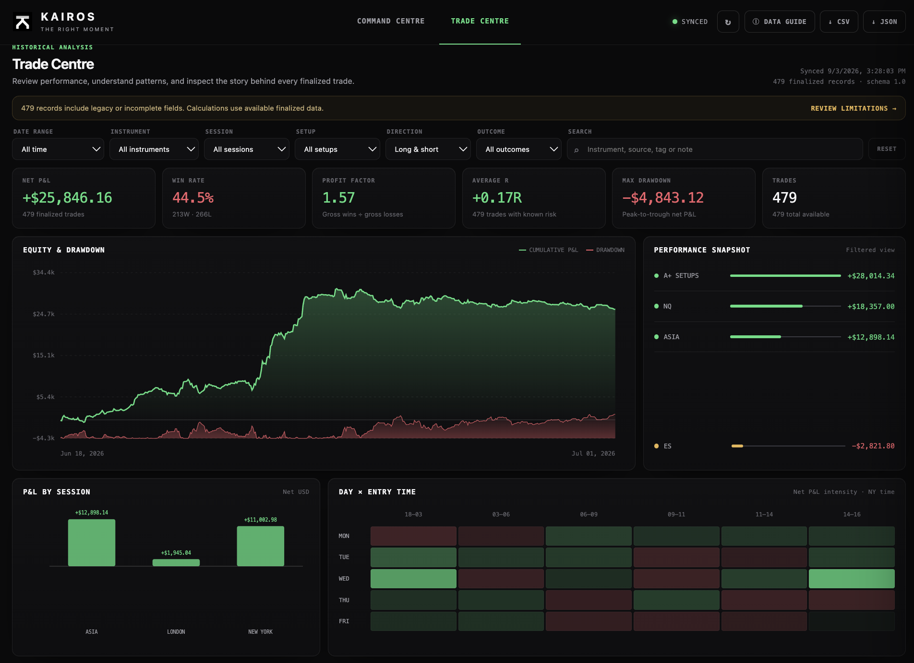
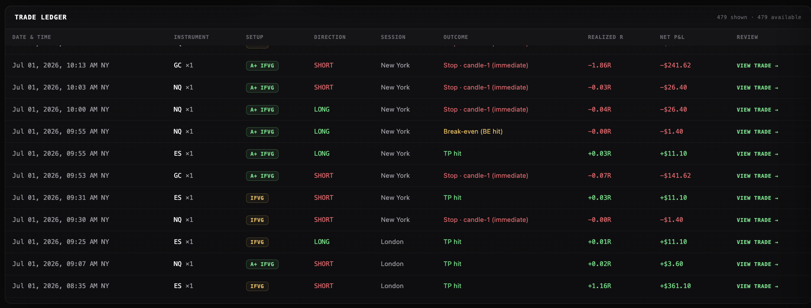

# KAIROS v3

## Trade Centre

KAIROS now includes a separate, token-protected Trade Centre for reviewing
finalized trades without changing anything in the Command Centre.

- Filter by date, instrument, session, setup, direction, outcome, or search.
- Review P&L, win rate, profit factor, average R, drawdown, equity, session
  performance, and the day/time heatmap.
- Open any ledger row to see why it entered, what was planned, what happened,
  data provenance, and review notes/tags.
- Export the current view to CSV or the full normalized records to JSON.

After updating and safely restarting KAIROS, open
`https://app.<your-domain>/trade-centre` and use the same
`DASHBOARD_TOKEN` as the Command Centre. Existing local trade history is
normalized automatically; notes and tags remain private in
`trade_reviews.json`.

The screenshots show the interface with one local historical dataset. They are
not a guarantee or independently verified statement of future performance.
